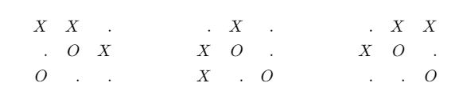

# Lab10 - Tic Tac Toe with Reinforcement Learning
This repo contains the solution to the tenth laboratory of the 2023/2024 Computational Intelligence PoliTo course. The goal is to create a Reinforcement Learning Algorithm to train an agent on the Tic Tac Toe game.
## Authors
The contributors of this repo are:
* [Stefano Barcio](https://github.com/stefbarcio/computational_intelligence_23-24), s320174 
* [Luca Faieta](https://github.com/LucaFaieta/Computational_Intelligence), s323770

## Sources 
This solution has been mainly inspired by course lectures and some little searching online

## Solution Overview
The main change we applied to the proposed code it's to take into account symmetries in the Tic Tac Toe game.

An agent that has to learn how to play, needs to memorize positions and visit them many times in order to evaluate a Value Function (i.e. a way to estimate goodness of a position/action).

In a basic tic tac toe game there are roughly 19.000 possible states, and the algorithm needs to accumulate information on each of those. Our intuition was that not every board position it's really unique: many of them can be derived by others simply applying rotations and/or symmetries.

  

As you can see, the positions above, while apparently different, are actually the same just rotated and then mirrored. Our implementation makes the learning algorithm able to understand this aggregation.

In this way the number of positions in the Value Dictionary is reduced (by a factor of 4, i.e. all the possible symmetries of each position) and the learned features are aggregated, thus enhancing the learning capability.

## Our results
We trained three agents (epsilon=0.001) each one for respectively 5000,50.000 and 500.000 epochs. We then played all the combinations a hundred times, and found the following results.

| **match** | **A1 wins** | **A2 wins** | **A3 wins** |
|:---:|:---:|:---:|:---:|
| **A1 vs A2** | 91 | 9 | - 
| **A1 vs A3** | 89 | - | 11  
| **A2 vs A1** | 0 | 100 | -
| **A2 vs A3** | - | 87 | 13
| **A3 vs A1** | 0 | - | 100
| **A3 vs A2** | - | 0 | 100   

What we can see it's that there is a huge advantage for the first player that moves. The best algorithm also seems to be the third, suggesting that increasing training time could lead to better results. However, we did a quick test with 5M epochs and the results were comparable to 500k.

## Reproduce our code
You're welcome to verify our conclusions using the code in this folder. The training and testing section are indicated in the code.