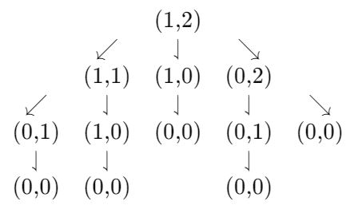

# Lab2 - Winning *Nim* with evolutionary algorithms
This repo contains the solution to the second laboratory of the 2023/2024 Computational Intelligence PoliTo course. The goal is to find a winning strategy for the game [Nim](https://en.wikipedia.org/wiki/Nim). To address the problem we used an evolutionary algorithm based on MEP (multi-expression programming) 
## Authors
The contributors of this repo are:
* [Stefano Barcio](https://github.com/stefbarcio/computational_intelligence_23-24), s320174 
* [Luca Faieta](https://github.com/LucaFaieta/Computational_Intelligence), s323770

## Sources 
This solution was built from a paper published at the Cornell University of New York by Mihai Oltean, concerning evolutionary solutions for Nim and Nim-like games. The paper can be found at [this link](https://arxiv.org/abs/2109.13109) 

## Solution Overview
The key concept of this solution is to divide game positions in two categories, based on the advantage that they give to the players. Any move represents a possible state of the game board. N-positions are positions that give advantage to the current player (i.e. the one who just made the move), while P-positions are those who give advantaged to the opponent. N and P positions are determined by a function called nim-sum.

$$
pos\_state = 
\begin{cases}
N & \text{ if } \ nim\_sum = 0 \\
P & \text{ otherwise}
\end{cases}
$$

The nim_sum function can be arbitrarily defined, but there is a family of functions that guarantee a winning strategy. The most well-known in literature is :

$$
nim\_sum = A \text{ } xor B \text{ } xor \text{  } C \text{ } ... \text{  } xor \text{ } N
$$

where N is the number of piles in the game. Using this function, a player that only makes moves for which the resulting position has nim_sum = 0 is guaranteed to win the game.

The goal of our algorithm is to find a winning nim_sum (or at least a very good one) at the start of the match, and base its game strategy on that.

## Methodology
### Evolutionary Approach to the solution
Our approach consists of generating a certain number of possible expressions for a given Nim board, and then to recombine them following the Genetic Programming paradigms of recombination and mutation until a winning solution is found.

### Expression Encoding
Expression are stored in Chromosome objects which consists of a series of genes, each one encoding a number or an arithmetical operation. Here follows a chromosome example:

$$
\begin{align*}
1 & : a \\
2 & : b \\
3 & : + \ 1, 2 \\
4 & : c \\
5 & : d \\
6 & : * \ 3, 5 \\
\end{align*}
$$

Letters identify piles of the board, while operations are built between the elements at the index pointed by the numbers. So, for example, line 3 means addition between element at index 1 and element at index 2

$$
E_3 = (a+b)
$$

This notation allows to easily concatenate operations, and if the chromosome is accessed from the ending the encoded operation becomes:

$$
E_3 = (a+b)*d
$$

### Fitness of a candidate
Our methodology is strongly based on the definition of **fitness** of a given chromosome, which is computed applying the encoded expression to the whole set of possible moves in a match. This structure can be easily represented by a tree where each node is a possible configuration of the board and is connected to all the next possible moves.

  

$$
\scriptsize{\text{A very small position tree generated from a Nim with two piles with 1 and 2 elements respectively.}}\\ 
\scriptsize{\text{ We are going to compute the expression value for each node
}} 
\\
\
$$

After computing the state of every node, there are three theorems that run the winning strategy for the Nim game
(Berlekamp 1988):

1. $\small{\textit{any move applied to a P-position turns the game into a N-position}}$
2. $\small{\textit{there is at least one move that turns the game from a N-position into a P-position}}$
3. $\small{\textit{the final position (when the game is over) is a P-position}}\\
\ $

At this point it's enough to apply `fitness_function(expression)` to the tree, which will return the sum of all the violations of the rules above on the specific tree  

If, for a certain chromosome, the expression encoded has fitness = 0, that expression is a winning strategy.

### The evolution
Our method evolves through a given number of generations. 
A generation (called dna in the code) is a set of N chromosome, randomly generated.

The algorithm then executes the following steps, until an optimal solution is found or a given number of iterations is reached:

  1. **parents selection**: every four genes, the algorithm draws two *parents*, i.e. chromosomes selected for evolution
  2. **offspring generation**: the offspring is generated by recombining the genes of the two parents (*one-point crossover* technique) and then the offspring are considered for mutation with a certain probability
  3. **survival selection**: the fittest offspring is selected, and added to the dna if its score is better than the lowest score in the dna

## Our results
We tested this strategy against the ones proposed in class and ran the match 50 times for each configuration. All simulations are ran over a three-column Nim Map (1,3,5)

1. `population_size` : 100
2. `chromosome_dimension` : 10
3. `mutation_probability` : 0.9
4. `tournament_size` : 4
5. `num_generations` : 150

| **match (P0 vs P1)** | **P0 wins** | **P1 wins** |
|:---:|:---:|:---:|
| **evo vs random** | 47 | 3 
| **evo vs gabriele** | 47 | 3 
| **evo vs opt** | 37 | 11
| **opt vs evo** | 0 | 50  

The algorithm proves to be highly more efficient than the "silly" strategies already on small numbers of generations and population size, so we decided to simulate more in detail the ***evo vs opt*** match. Note that the optimal algorithm can't be defeated when it moves first, as confirmed by our tests

| **evo vs optimal** | **pop_size** | **num_gen** | **P0 wins** |**P1 wins** |
|:---:|:---:|:---:|:---:|:---:|
| | 12 | 30 | 8 | 42
| | 50 | 50 | 29 | 21
| | 100 | 150 | 37 | 11
| | 140 | 500 | 45 | 5
| | 240 | 1000 | 49 | 1

It's evident how giving more "room" to the evolutionary algorithm, both in terms of population size and number of generations, leads to increasingly better results as solutions with fitness 0 are found more frequently.

Another interesting thing to point out is that all defeats happened when the fitness function was not 0, so in cases where the actual optimal solution was not found

## Reproduce our code
You're welcome to verify our conclusions using the code in this folder. The last snippet of code is used as a "*main*" . It's enough to select a strategy for the two players among those defined in the sections above and let the program run to show the match.
All parameters for the evolutionary algorithm can be set at the start of the file
